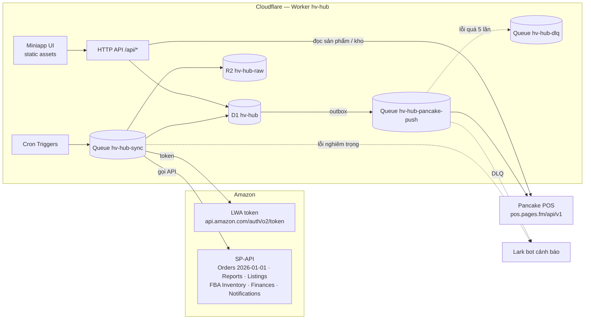

# HV Hub — Giải pháp đồng bộ Amazon → Cloudflare D1 → Pancake POS

> Phiên bản **v0.3** (chốt thiết kế trước khi code) · Ngày 06/10/2026
> Tên dự án: **hv-hub**. Mọi tài nguyên (repo, Worker, D1, R2, Queue, secret, domain) đều đặt tên bắt đầu bằng `hv-hub`.
> Hệ thống **mới hoàn toàn**, không đọc/ghi DB SQL Server và không gọi job .NET/Hangfire cũ. Hai hệ thống chạy song song được.

**Đã chốt với anh (v0.3)**

| # | Nội dung | Quyết định |
|---|---|---|
| 1 | Repo GitHub | Anh tạo `dungnt91/hv-hub` |
| 2 | Cloudflare | Anh chuẩn bị theo [CHUAN_BI.md](CHUAN_BI.md) mục C |
| 3 | Kết nối Amazon | Cấu hình theo cùng bộ trường như `Amazon_Configs` hiện tại: **ShopName, ClientId, ClientSecret, MarketplaceIds** + **RefreshToken** (bắt buộc, giải thích ở 2.2). Gọi API bản mới nhất (mục 3.2). |
| 4 | Kết nối Pancake | Có màn hình để anh tự cấu hình (mục 5.4) |
| 5.1 | Dữ liệu Amazon | **Bắt buộc: sản phẩm + đơn hàng.** Các dữ liệu khác em liệt kê kèm lợi ích để anh chọn (mục 3.2) |
| 5.2 | Khách / địa chỉ trên Pancake | Pancake **đã có sẵn** khách + địa chỉ; chỉ cần cấu hình ánh xạ. **Không lấy PII từ Amazon** (đã bị ẩn), không cần role PII |
| 5.3 | Trạng thái Amazon → Pancake | **Bắt buộc có bước cấu hình ánh xạ trạng thái** trên miniapp (mục 5.4) |

**Thay đổi so với v0.1**

| Mục | v0.1 | v0.2 |
|---|---|---|
| Tên | `amz-pancake-hub` | **`hv-hub`** cho mọi thứ (mục 10) |
| Dữ liệu Amazon | Chỉ đơn hàng | Đơn hàng + sản phẩm/listing + tồn kho FBA + tài chính/phí + hoàn hàng (mục 3) |
| Mapping sản phẩm | Bảng `sku_map` đơn giản | Mapping đầy đủ: tự khớp, combo/bundle, theo marketplace, có lịch sử, import/export CSV (mục 4) |
| Giao diện | React tự do | Theo **design system của ops.hvholdings.vn** (`hvx-theme.css`, Tailwind 4 + shadcn/ui), bố cục thanh tab trên cùng như ops (mục 6) |
| Đăng nhập | Cloudflare Access | **Tài khoản + vai trò giống ops** (PBKDF2, cookie ký HMAC, quyền theo màn hình và theo shop). Cloudflare Access chỉ là lớp bảo vệ thêm (tuỳ chọn) |
| Mã hoá | `MASTER_KEY` | `DATA_KEY`, cùng định dạng `v1:<iv>:<ciphertext>` như ops |
| Repo | Đề xuất | Repo mới `dungnt91/hv-hub` (anh tạo, mục 10) |

---

## 0. Tóm tắt theo 13 yêu cầu

| # | Yêu cầu | Giải pháp |
|---|---|---|
| 1 | Token như hiện tại, cấu hình được, tự refresh | Mỗi shop nhập ShopName, ClientId, ClientSecret, RefreshToken, MarketplaceIds trên miniapp (lưu mã hoá). Access token cache trong D1 và tự refresh khi còn dưới 5 phút. Cron dự phòng 30 phút. Không cần AWS SigV4/AccessKey/RoleArn. Danh sách cần anh cấp: [CHUAN_BI.md](CHUAN_BI.md) mục A. |
| 2 | Sync **tất cả** đơn Amazon về D1 | Incremental 5 phút theo `lastUpdatedAfter` + backfill lịch sử chạy tiếp được + (giai đoạn sau) notification `ORDER_CHANGE`. |
| 3 | Đẩy D1 → Pancake qua API | Màn hình cấu hình 4 bước (kết nối, tuyến đơn, khách/địa chỉ có sẵn, ánh xạ trạng thái). Outbox + Cloudflare Queue, retry, DLQ, chống tạo trùng bằng `custom_id = AmazonOrderId`. Thông tin cần: [CHUAN_BI.md](CHUAN_BI.md) mục B. |
| 4 | Miniapp trên Cloudflare | 1 Worker có static assets (cách ops đang chạy, thay cho Pages). Domain đề xuất `hub.hvholdings.vn`. |
| 5 | API mới của Amazon | Orders API **v2026-01-01** (`searchOrders`, `getOrder` + `includedData`). Các API khác dùng bản mới nhất (mục 3.1). |
| 6 | Nhật ký mọi thao tác | `audit_log` + `job_run` + `api_call_log` + lịch sử đơn + payload thô ở R2, liên kết bằng `correlation_id`. |
| 7 | Chuyển D1 → PostgreSQL không vướng | Quy tắc schema trung tính + Drizzle ORM + migration chạy thử trên cả SQLite và Postgres trong CI. |
| 8 | Code mới hoàn toàn | Repo riêng, không phụ thuộc code cũ. |
| 9 | Giao diện giống ops.hvholdings.vn | Dùng nguyên `design-system/` của repo `hv-x-operations` (token màu, bảng số liệu, nhãn tình trạng, thẻ KPI). |
| 10 | Sync các dữ liệu của Amazon | 6 nhóm dữ liệu, ưu tiên theo giai đoạn (mục 3.2). |
| 11 | Mapping sản phẩm Amazon → Pancake | Màn hình Mapping riêng, tự khớp theo mã, hỗ trợ combo, chặn đẩy đơn khi chưa map (mục 4). |
| 12 | Source code mới trên GitHub | `dungnt91/hv-hub` (private). |
| 13 | Thư mục `hv-hub`, đặt tên tất cả theo hv-hub | Quy ước đặt tên ở mục 10. |

---

## 1. Kiến trúc tổng thể



- **Một Worker, 3 entrypoint:** `fetch` (UI + API), `scheduled` (cron chỉ xếp việc), `queue` (làm việc thật). Cron không tự gọi Amazon mà đẩy việc vào `hv-hub-sync`, nên mỗi shop × loại dữ liệu là 1 message độc lập, lỗi shop này không kéo shop khác.
- Khi tải lớn có thể tách consumer ra Worker riêng mà không đổi code nghiệp vụ.
- **Stack:** TypeScript, Hono (router), Drizzle ORM, Zod, React + Vite + Tailwind 4 + shadcn/ui + design system HVX, Wrangler. Vitest cho test.

---

## 2. Token Amazon: cấu hình và tự refresh (yêu cầu #1)

### 2.1 Cơ chế
- SP-API chỉ cần header `x-amz-access-token`. **Bỏ hẳn AWS SigV4, AccessKey, SecretKey, RoleArn** của code cũ.
- Lấy access token: `POST https://api.amazon.com/auth/o2/token` (`grant_type=refresh_token`, `refresh_token`, `client_id`, `client_secret`). Token sống ~3600 giây.
- **Lazy refresh:** trước mỗi lời gọi, nếu `expires_at - now < 5 phút` thì refresh.
- **Cron dự phòng 30 phút:** refresh shop sắp hết hạn để UI luôn đúng trạng thái.
- **Khoá chống refresh trùng:** `UPDATE hv_access_token SET lock_until=? WHERE shop_id=? AND lock_until < ?`; ai cập nhật được thì refresh, còn lại đợi 1–2 giây rồi đọc lại.
- **Lỗi `invalid_grant`** (seller thu hồi quyền / token hỏng): shop chuyển `auth_error`, dừng sync shop đó, báo Lark, hiện banner đỏ trên miniapp.
- **Client secret LWA có hạn** và phải xoay vòng định kỳ: lưu `secret_expires_at`, cảnh báo trước 14 ngày; màn hình cấu hình cho thay secret không cần deploy.
- **Thêm shop mới:** giai đoạn 1 nhập `refresh_token` có sẵn (lấy bằng *Authorize app* trong Seller Central như hiện tại). Giai đoạn sau có thể làm luồng OAuth "Kết nối Amazon" (Website authorization workflow) ngay trên miniapp nếu anh cần cho nhiều shop.

### 2.2 Màn hình "Cấu hình → Kết nối Amazon"
Mỗi shop là 1 dòng cấu hình, cùng bộ trường như bảng `Amazon_Configs` hiện tại:

| Ô | Bắt buộc | Ghi chú |
|---|---|---|
| **ShopName** | ✔ | Tên hiển thị trên miniapp |
| **ClientId** | ✔ | LWA client id của app SP-API (nhiều shop dùng chung 1 app thì nhập lại cùng giá trị) |
| **ClientSecret** | ✔ | Ẩn sau khi lưu, chỉ hiện 4 ký tự cuối; có ô "Hết hạn ngày" để cảnh báo xoay vòng |
| **RefreshToken** | ✔ | **Bắt buộc.** ClientId/ClientSecret chỉ xác định *app*; RefreshToken là quyền seller cấp cho app để đọc dữ liệu *của shop*. Không có thì Amazon không trả đơn/sản phẩm. Lấy từ `Amazon_Configs.RefreshToken` hiện tại. |
| **MarketplaceIds** | ✔ | Chọn nhiều, hiện kèm tên nước (VD `ATVPDKIKX0DER` · Hoa Kỳ). **Region tự suy ra** từ marketplace (bảng dưới), anh không phải nhập. Các marketplace của 1 shop phải cùng region. |
| Seller ID | | Tuỳ chọn, chỉ cần khi làm notification realtime |
| Dữ liệu sync | | Bật/tắt từng nhóm (đơn hàng, sản phẩm, …) và lịch chạy |

| Region | Endpoint | Marketplace thường dùng |
|---|---|---|
| `na` | `sellingpartnerapi-na.amazon.com` | US `ATVPDKIKX0DER` · CA `A2EUQ1WTGCTBG2` · MX `A1AM78C64UM0Y8` · BR `A2Q3Y263D00KWC` |
| `eu` | `sellingpartnerapi-eu.amazon.com` | UK `A1F83G8C2ARO7P` · DE `A1PA6795UKMFR9` · FR `A13V1IB3VIYZZH` · IT `APJ6JRA9NG5V4` · ES `A1RKKUPIHCS9HS` · NL `A1805IZSGTT6HS` · SE `A2NODRKZP88ZB9` · PL `A1C3SOZRARQ6R3` · BE `AMEN7PMS3EDWL` · TR `A33AVAJ2PDY3EV` · AE `A2VIGQ35RCS4UG` · SA `A17E79C6D8DWNP` · IN `A21TJRUUN4KGV` |
| `fe` | `sellingpartnerapi-fe.amazon.com` | JP `A1VC38T7YXB528` · AU `A39IBJ37TRP1C6` · SG `A19VAU5U5O7RUS` |

**Nút "Test kết nối"** (bắt buộc bấm trước khi bật sync):
1. Đổi RefreshToken lấy access token → sai ClientId/ClientSecret/RefreshToken thì báo rõ ô nào.
2. Gọi Sellers API `getMarketplaceParticipations` → đối chiếu MarketplaceIds đã nhập với marketplace shop thật sự tham gia; marketplace không thuộc shop thì cảnh báo.
3. Gọi `searchOrders` 1 bản ghi và Reports API → xác nhận app có đủ role cho đơn hàng và sản phẩm.
4. Hiện kết quả từng bước kèm `x-amzn-RequestId`, ghi `hv_audit_log`.

**Trạng thái token** hiện trên dòng shop: còn hạn đến, lần refresh cuối, lỗi gần nhất.

### 2.3 Lưu trữ an toàn (giống ops)
- `client_secret`, `refresh_token`, `access_token`, Pancake `api_key`, Lark secret đều mã hoá **AES-256-GCM** bằng Worker secret `DATA_KEY` (32 byte base64), định dạng `v1:<iv>:<ciphertext>`. Lưu kèm `key_hint` (4 ký tự cuối).
- API không bao giờ trả secret ra ngoài. Mọi thao tác xem/sửa/test cấu hình ghi `audit_log`.

---

## 3. Đồng bộ dữ liệu Amazon (yêu cầu #2, #5, #10)

### 3.1 Khung sync chung
Mọi loại dữ liệu đi qua cùng một khung, nên thêm dữ liệu mới chỉ là thêm 1 "dataset":

```
dataset = { key, api, schedule, cursor type, fetch(window|token) → rows, upsert(rows) }
```
- `hv_sync_cursor(shop_id, dataset, mode)` giữ watermark / cửa sổ / `nextToken` / `reportId`. Chỉ tiến watermark khi cả cửa sổ thành công → dừng ở đâu chạy tiếp ở đó.
- **Rate limiter** token bucket theo (shop, operation) lưu D1, tự điều chỉnh theo header `x-amzn-RateLimit-Limit`. `429` → backoff luỹ thừa có jitter; `5xx` → retry 3 lần; `403` → refresh token rồi thử lại đúng 1 lần.
- **Luồng Reports API** (cho dữ liệu lớn): `createReport` → message đợi (delay queue) → `getReport` đến khi `DONE` → `getReportDocument` → tải file (giải nén gzip bằng `DecompressionStream`) → lưu R2 → parse TSV/JSON theo lô → upsert.
- Mọi thời gian lưu **UTC ISO-8601**; chỉ UI đổi sang giờ VN.

### 3.2 Các nhóm dữ liệu

Luôn gọi **bản API mới nhất** của từng nhóm (cập nhật 10/2026). Khi Amazon ra bản mới, chỉ cần sửa trong `src/amazon/datasets/*`.

**Bắt buộc (anh đã chốt) — làm ở P1**

| # | Nhóm | API bản mới nhất | Tần suất | Dùng để |
|---|---|---|---|---|
| D1 | **Đơn hàng** (đơn + item + tiền + trạng thái + vận chuyển) | Orders **v2026-01-01**: `searchOrders`, `getOrder`; `includedData = FULFILLMENT, PROCEEDS, PROMOTION, CANCELLATION`. **Không** lấy `BUYER`/`RECIPIENT` (PII đã ẩn, không cần role PII) | 5 phút + backfill | Đẩy đơn lên Pancake |
| D2 | **Sản phẩm / listing** (SKU, ASIN, FNSKU, tên, ảnh, giá, FBA/FBM, trạng thái) | Reports **2021-06-30** `GET_MERCHANT_LISTINGS_ALL_DATA` (lấy toàn bộ); Listings Items **2021-08-01** `getListingsItem` (làm mới 1 SKU); Catalog Items **2022-04-01** (tên/ảnh chuẩn theo ASIN) | 1 lần/ngày + nút làm mới | Mapping sản phẩm sang Pancake |

**Em đề xuất thêm — anh chọn** (mỗi nhóm là 1 dataset bật/tắt được theo shop, không ảnh hưởng phần bắt buộc)

| # | Nhóm | API bản mới nhất | Lợi ích cụ thể | Role cần thêm | Mức |
|---|---|---|---|---|---|
| D3 | **Hoàn hàng / hoàn tiền** | Reports `GET_FBA_FULFILLMENT_CUSTOMER_RETURNS_DATA` (FBA), `GET_FLAT_FILE_RETURNS_DATA_BY_RETURN_DATE` (FBM); sự kiện refund lấy từ Finances | Cập nhật đơn Pancake sang hoàn; biết SKU nào hoàn nhiều, lý do hoàn | Amazon Fulfillment | **Nên có** |
| D4 | **Tồn kho FBA** | FBA Inventory **v1** `getInventorySummaries` | Biết tồn ở kho Amazon theo SKU (sẵn bán, đang nhập, giữ chỗ, hỏng); cảnh báo sắp hết hàng; đối chiếu với tồn Pancake | Amazon Fulfillment | **Nên có** (nếu bán FBA) |
| D5 | **Tài chính / phí theo đơn** | Finances **2024-06-19** `listTransactions` | Tiền thực nhận từng đơn sau phí bán, phí FBA, khuyến mãi, hoàn → lãi thật theo đơn/SKU | Finance and Accounting | **Nên có** |
| D6 | **Kỳ thanh toán (settlement)** | Reports `GET_V2_SETTLEMENT_REPORT_DATA_FLAT_FILE_V2` | Đối soát tiền Amazon chuyển về tài khoản theo từng kỳ | Finance and Accounting | Tuỳ chọn |
| D7 | **Doanh số & traffic theo ASIN** | Reports `GET_SALES_AND_TRAFFIC_REPORT` | Lượt xem, tỉ lệ chuyển đổi, Buy Box % theo ngày/ASIN — báo cáo vận hành kiểu ops | Brand Analytics (cần Brand Registry) | Tuỳ chọn |
| D8 | **Lô hàng gửi kho FBA** | Fulfillment Inbound **2024-03-20** | Theo dõi hàng đang đi vào kho Amazon | Amazon Fulfillment | Tuỳ chọn |
| D9 | **Giá & Buy Box** | Product Pricing **2022-05-01** | Theo dõi giá cạnh tranh, mất Buy Box | Pricing | Tuỳ chọn |
| D10 | **Realtime đơn** | Notifications `ORDER_CHANGE` qua EventBridge | Đơn về sau vài giây thay vì ≤ 5 phút | — (cần tài khoản AWS) | Tuỳ chọn, P5 |

> Quảng cáo Amazon (Sponsored Products, chi phí ads) **không nằm trong SP-API** mà là Amazon Ads API riêng, cần đăng ký app và token riêng. Nếu anh cần thì làm thành giai đoạn riêng.
>
> Mặc định nếu anh không chọn: P1 = D1 + D2; P4 = D3 + D4 + D5.

### 3.3 Đơn hàng (D1) chi tiết

| Operation | Path | Rate / Burst mặc định | Dùng cho |
|---|---|---|---|
| `searchOrders` | `GET /orders/2026-01-01/orders` | thấp (≈1 req/3 phút, burst 20 — **đọc header thật để chỉnh**) | Incremental, backfill |
| `getOrder` | `GET /orders/2026-01-01/orders/{orderId}` | 0,5 rps / 30 | Sync lại 1 đơn, xử lý notification |

- `createdAfter` **hoặc** `lastUpdatedAfter` (đúng một trong hai); mốc `...Before` phải trước giờ gọi ≥ 2 phút. `maxResultsPerPage` ≤ 100, `paginationToken` hết hạn sau 24 giờ.
- **A. Incremental (5 phút, mỗi shop độc lập):** `from = watermark − 10 phút` (chồng lấn chống sót), `to = now − 3 phút` → lặp trang → lưu raw R2 → upsert `hv_amz_order`, `hv_amz_order_item` → ghi `hv_amz_order_event` nếu trạng thái/tiền đổi → đơn đủ điều kiện vào `hv_push_outbox` (cùng `batch()`) → xong mới `watermark = to`. Bắt được mọi thay đổi (Pending → Shipped, huỷ, hoàn), khác code cũ chỉ nhìn `CreatedAfter` 7 ngày.
- **B. Backfill:** chọn shop + khoảng ngày trên miniapp, chia cửa sổ 7 ngày theo `createdAfter/Before`, lưu tiến độ, dừng/tiếp được. Nếu lịch sử rất lớn: dùng Reports `GET_FLAT_FILE_ALL_ORDERS_DATA_BY_LAST_UPDATE_GENERAL` nạp nhanh rồi `searchOrders` bổ sung.
- **Trạng thái mới:** `PENDING_AVAILABILITY, PENDING, UNSHIPPED, PARTIALLY_SHIPPED, SHIPPED, CANCELLED, UNFULFILLABLE`.
- **Tiền:** số nguyên đơn vị nhỏ nhất (`*_minor INTEGER`) + `currency`, không dùng float. Lưu nguyên các thành phần (giá × SL, proceeds breakdown, promotion). Tính toán cho Pancake nằm ở tầng mapping, không sửa dữ liệu gốc.
- **Không dùng cookie/API nội bộ Seller Central dưới bất kỳ hình thức nào.** ⚠️ Cần kiểm tra thực tế đơn `PENDING` trong v2026 có `unitPrice` hay không.

---

## 4. Mapping sản phẩm Amazon → Pancake (yêu cầu #11)

### 4.1 Dữ liệu hai phía
- **Amazon:** `hv_amz_listing` (từ D2): shop, marketplace, `seller_sku`, `asin`, `fnsku`, tên, ảnh, giá, kênh FBA/FBM, trạng thái. SKU xuất hiện trong đơn nhưng chưa có trong listing cũng được tự thêm (để không sót).
- **Pancake:** `hv_pk_variation` cache từ `GET /shops/{SHOP_ID}/products/variations` (id mẫu mã, product_id, tên, `display_id`/mã mẫu mã, barcode, giá, tồn). Làm mới 1 lần/ngày + nút "Tải lại sản phẩm Pancake".

### 4.2 Bảng mapping
```
hv_product_map      (id, shop_id, marketplace_id NULL = mọi marketplace, seller_sku,
                     status: active|ignored, match_method: auto_code|auto_barcode|manual|import,
                     note, updated_by, updated_at, version)
hv_product_map_line (map_id, pancake_shop_id, pancake_product_id, pancake_variation_id, qty, price_ratio)
hv_product_map_hist (id, map_id, ts, actor, before_json, after_json)
```
- **1 SKU → 1 mẫu mã** (thường gặp) hoặc **1 SKU → nhiều mẫu mã kèm số lượng** (combo/bundle, ví dụ "Combo 3 hộp" = mẫu mã A × 3). `price_ratio` chia giá Amazon cho từng dòng combo (mặc định theo giá Pancake).
- Ưu tiên khớp: map theo marketplace cụ thể → map chung mọi marketplace.
- **Ignored**: SKU không cần đẩy (ví dụ quà tặng, phí) — đơn vẫn đẩy, dòng đó bỏ qua và ghi chú.
- Mọi lần sửa ghi lịch sử; đơn đã đẩy giữ snapshot mapping lúc đẩy (`hv_pancake_order_link.map_snapshot_json`) để đối soát.

### 4.3 Tự khớp
1. `seller_sku` = mã mẫu mã Pancake (`display_id`/custom id) — không phân biệt hoa thường, bỏ khoảng trắng.
2. ASIN / FNSKU / barcode trùng `barcode` Pancake.
3. Không khớp → nằm ở danh sách **"Chưa map"**, gợi ý theo tên gần giống (chỉ gợi ý, người duyệt).
Kết quả tự khớp ở trạng thái "chờ duyệt" lần đầu; anh có thể bật "tự duyệt khi khớp mã chính xác".

### 4.4 Màn hình Mapping
- Bảng: SKU Amazon · ASIN · tên · marketplace · → mẫu mã Pancake (tên, mã, tồn) · cách khớp · số đơn đang chờ vì chưa map.
- Lọc: Chưa map / Chờ duyệt / Đã map / Bỏ qua. Sửa nhanh trong dòng, chọn mẫu mã bằng ô tìm kiếm.
- **Import / Export CSV** (`shop, marketplace, seller_sku, pancake_variation_id|mã, qty`) có bước xem trước và báo lỗi từng dòng.
- Map xong → các đơn đang `WAITING_MAP` tự vào lại hàng đợi đẩy.

---

## 5. Đẩy đơn lên Pancake POS (yêu cầu #3)

### 5.1 API Pancake dùng tới
Base URL `https://pos.pages.fm/api/v1`, xác thực `?api_key=` (đã dùng ổn định ở ops). **Body bắt buộc `Content-Type: application/json`** (ops đã kiểm chứng: gửi sai kiểu thì Pancake bỏ qua tham số).

| Việc | Endpoint |
|---|---|
| Tạo đơn | `POST /shops/{SHOP_ID}/orders` |
| Cập nhật đơn / trạng thái | `PUT /shops/{SHOP_ID}/orders/{ORDER_ID}` |
| Xem đơn / tìm đơn | `GET /shops/{SHOP_ID}/orders/{ORDER_ID}` · `GET /shops/{SHOP_ID}/orders?search=` |
| Kho | `GET /shops/{SHOP_ID}/warehouses` |
| Sản phẩm / mẫu mã | `GET /shops/{SHOP_ID}/products`, `GET /shops/{SHOP_ID}/products/variations` |
| Nguồn đơn, thẻ | `GET /shops/{SHOP_ID}/order_source`, danh sách thẻ |

⚠️ Danh sách trường khi tạo đơn (`bill_full_name`, `bill_phone_number`, `items[]`, `warehouse_id`, `shipping_address{…}`, `custom_id`, `note`, `shipping_fee`, `total_discount`, `surcharge`, `tags`, `order_sources`…) **phải test trên 1 shop Pancake thử** trước khi chốt mapping (P3, bước đầu tiên).

### 5.2 Luồng đẩy
```
upsert đơn ──(đủ điều kiện)──► hv_push_outbox (cùng batch D1)
cron 1 phút: outbox → Queue hv-hub-pancake-push
consumer (max_concurrency=1 / shop Pancake, ≤ 60 req/phút):
  0. Kiểm tra mapping đủ chưa → thiếu: state=WAITING_MAP (không gọi Pancake)
  1. Chưa có link → dựng payload → state=PUSHING → POST
     Đã có link   → so payload_hash → khác thì PUT (trạng thái / huỷ)
  2. OK → lưu pancake_order_id, state=PUSHED
  3. 4xx dữ liệu → FAILED_DATA (không retry, hiện trên UI)
  4. 429/5xx/timeout → retry backoff; quá 5 lần → DLQ + Lark
```
- **Chống tạo trùng:** `custom_id = AmazonOrderId` + trạng thái `PUSHING` ghi trước khi POST. Timeout không rõ kết quả → tìm trên Pancake theo mã đơn Amazon trước khi tạo lại.
- **Chế độ chạy thử (dry-run)** theo shop: dựng payload, lưu, hiện trên UI nhưng không gửi. Bật đẩy thật khi anh duyệt 10–20 đơn mẫu.

### 5.3 Ánh xạ đề xuất (anh duyệt ở [CHUAN_BI.md](CHUAN_BI.md) mục E)

| Amazon | Pancake | Đề xuất |
|---|---|---|
| `AmazonOrderId` | `custom_id`, `note` | mã đơn Amazon |
| `sellerSku` | `items[]` | qua mapping (mục 4), combo tách thành nhiều dòng |
| `quantityOrdered` | `items[].quantity` | × `qty` của combo |
| `unitPrice` | giá mẫu mã | chênh lệch vào `discount_each_product` / `surcharge` |
| Khuyến mãi | `total_discount` | |
| Phí ship + gift wrap | `shipping_fee` / `surcharge` | |
| Khách / địa chỉ | `bill_*`, `shipping_address` | Lấy từ **khách + địa chỉ có sẵn trên Pancake** theo cấu hình (mục 5.4). Không dùng dữ liệu khách từ Amazon |
| FBA / FBM | `warehouse_id` | FBA → kho ảo "Amazon FBA", FBM → kho thật |
| Shop / marketplace | `order_sources`, `tags` | nguồn "Amazon", thẻ `AMZ-US`… |
| Trạng thái | `status` | Theo bảng ánh xạ trạng thái anh cấu hình (mục 5.4) |

### 5.4 Màn hình "Cấu hình → Pancake" (anh tự cấu hình)
Gồm 4 bước, làm lần lượt; bước sau mở khi bước trước đã lưu.

**Bước 1 — Kết nối shop Pancake**
| Ô | Ghi chú |
|---|---|
| Tên, `SHOP_ID`, `api_key` | `api_key` ẩn sau khi lưu (4 ký tự cuối) |
| Nút **Kiểm tra kết nối** | Gọi Pancake lấy tên shop, kho, nguồn đơn, thẻ, trạng thái → báo OK/lỗi |

**Bước 2 — Tuyến đơn (shop/marketplace Amazon → shop Pancake)**
| Ô | Ghi chú |
|---|---|
| Shop Amazon + marketplace | 1 tuyến cho từng marketplace, hoặc "mọi marketplace" |
| Shop Pancake nhận đơn | |
| Kho FBA, kho FBM | Chọn trong danh sách kho lấy từ Pancake |
| Nguồn đơn, thẻ | Chọn từ Pancake; thẻ có biến `{marketplace}` (VD `AMZ-{marketplace}` → `AMZ-US`) |
| Chế độ | Chạy thử (chỉ dựng đơn, không gửi) / Đẩy thật |

**Bước 3 — Khách & địa chỉ** (dùng dữ liệu có sẵn trên Pancake, không lấy từ Amazon)
| Ô | Ghi chú |
|---|---|
| Khách mặc định | Tìm và chọn khách có sẵn trên Pancake theo tên/SĐT → tự điền `bill_full_name`, `bill_phone_number` |
| Địa chỉ giao | Chọn 1 địa chỉ có sẵn của khách đó → tự điền `shipping_address` (tên, SĐT, địa chỉ, mã tỉnh/huyện/xã) |
| Ghi đè theo tuyến | Mỗi tuyến (marketplace) có thể chọn khách/địa chỉ khác |
| Ghi chú đơn | Mẫu có biến: `Amazon {amazon_order_id} · {marketplace} · {fulfilled_by}` |

**Bước 4 — Ánh xạ trạng thái (bắt buộc trước khi đẩy thật)**
Bảng mỗi dòng là 1 trạng thái Amazon, tách riêng FBA và FBM:

| Trạng thái Amazon | Kênh | Hành động | Trạng thái Pancake |
|---|---|---|---|
| `PENDING_AVAILABILITY`, `PENDING` | FBA/FBM | Không đẩy *(đề xuất)* | — |
| `UNSHIPPED` | FBM | Tạo đơn | chọn (VD "Mới" / "Đã xác nhận") |
| `PARTIALLY_SHIPPED` | FBM | Tạo / cập nhật | chọn |
| `SHIPPED` | FBA | Tạo / cập nhật | chọn (VD "Đã gửi hàng") |
| `SHIPPED` | FBM | Tạo / cập nhật | chọn |
| `CANCELLED` | FBA/FBM | Huỷ đơn đã đẩy | chọn (VD "Đã huỷ") |
| `UNFULFILLABLE` | FBA/FBM | Không đẩy / cảnh báo | — |
| Hoàn hàng (nếu bật D3) | FBA/FBM | Cập nhật | chọn (VD "Đang hoàn" / "Đã hoàn") |

- **Hành động** chọn 1 trong: *Không đẩy* · *Tạo đơn* · *Tạo hoặc cập nhật* · *Chỉ cập nhật nếu đã có* · *Huỷ*.
- Danh sách trạng thái Pancake lấy từ shop thật, không gõ tay.
- **Khi đơn Pancake đã đi xa hơn** (VD đã đóng gói/đã gửi) mà Amazon đổi trạng thái lùi hoặc huỷ: tuỳ chọn *Bỏ qua + cảnh báo* (đề xuất) hoặc *Vẫn cập nhật*. Hệ thống không bao giờ tự lùi trạng thái nếu anh không bật.
- Chưa có ánh xạ cho 1 trạng thái → đơn đó dừng ở "Chờ cấu hình", không đẩy bừa.
- Mỗi lần lưu cấu hình ghi `hv_audit_log` (trước/sau); đơn đã đẩy lưu snapshot cấu hình lúc đẩy.

---

## 6. Miniapp (yêu cầu #4, #9)

### 6.1 Nền tảng (giống ops)
- Worker + Static Assets (Cloudflare khuyến nghị thay cho Pages). `/api/*` vào Worker, còn lại là file tĩnh. Header bảo mật trong `public/_headers`.
- Domain đề xuất `hub.hvholdings.vn` (zone hvholdings.vn đã ở Cloudflare, cấu hình `custom_domain` như ops).
- **Đăng nhập giống ops:** tài khoản/mật khẩu PBKDF2-SHA256, cookie phiên ký HMAC (`SESSION_SECRET`), tài khoản đầu tiên từ `ADMIN_USER`/`ADMIN_PASSWORD`, chống dò mật khẩu. Vai trò theo màn hình + giới hạn theo shop Amazon. Server kiểm quyền ở từng API (403). Tuỳ chọn đặt thêm Cloudflare Access phía trước.

### 6.2 Giao diện theo ops.hvholdings.vn
- Chép `design-system/` của `hv-x-operations` vào `hv-hub/web/src/styles` (`hvx-theme.css`, `hvx-components.css`, `hvx-format.ts`, `hvx-ui.tsx`). React + Vite + Tailwind 4 + shadcn/ui.
- Giữ tinh thần ops: một màu nhấn `#2a78d6`, màu xanh/vàng/đỏ/xám chỉ cho trạng thái, thẻ phẳng viền 1px, số `tabular-nums` canh phải, mỗi màn trả lời 1 câu hỏi (khung câu hỏi đầu trang), sáng/tối, không emoji/icon trang trí.
- Bố cục: **thanh trên** "HV Hub" + tab ngang + hộp người dùng; **hàng bộ lọc** dưới thanh tab; bảng `hvx-table`.

### 6.3 Màn hình
| Tab | Câu hỏi của màn | Nội dung |
|---|---|---|
| **Tổng quan** | Hôm nay dữ liệu có chạy đúng không? | Thẻ: đơn mới/cập nhật hôm nay, chờ đẩy, lỗi đẩy, chưa map, token sắp hết hạn. Bảng theo shop: lần sync cuối từng dataset, trạng thái. |
| **Đơn hàng** | Đơn Amazon nào đã/ chưa lên Pancake? | Lọc shop/marketplace/trạng thái Amazon/trạng thái đẩy/ngày. Chi tiết: item, tiền, lịch sử trạng thái, JSON gốc (R2), payload Pancake, link đơn Pancake. Nút **Sync lại**, **Đẩy lại**, **Bỏ qua** (ghi lý do). |
| **Sản phẩm & Mapping** | SKU nào chưa map? | Mục 4.4. |
| **Dữ liệu Amazon** | — | Tab con: Listing · Tồn FBA · Tài chính · Hoàn hàng (theo giai đoạn). |
| **Hàng đợi đẩy** | Đơn nào lỗi và vì sao? | FAILED_DATA / WAITING_MAP / DLQ, retry hàng loạt. |
| **Jobs** | Job nào đang chạy / lỗi? | Lịch, lần chạy, backfill (chạy/dừng/tiếp), chạy tay 1 dataset. |
| **Nhật ký** | Ai làm gì, lúc nào? | Tìm theo thời gian / người / hành động / mã đơn / `correlation_id`; mở chuỗi đầy đủ của 1 đơn. |
| **Cấu hình** *(quản trị)* | — | Kết nối Amazon · Pancake (shop, api_key, kho, nguồn, quy tắc ánh xạ) · Tài khoản · Vai trò · Cảnh báo Lark · Lưu trữ log. |

Có thể dựng mockup HTML click được trước khi code (skill hvh-admin-mockup) nếu anh muốn duyệt giao diện trước.

---

## 7. Nhật ký mọi thao tác (yêu cầu #6)

Mỗi request HTTP, mỗi lần cron, mỗi message queue có 1 `correlation_id`; mọi bản ghi phát sinh mang id này → lần lại toàn bộ chuỗi Amazon → D1 → Pancake của 1 đơn.

| Lớp | Ghi gì | Lưu |
|---|---|---|
| `hv_audit_log` | `ts, actor` (username / `system:cron` / `system:queue`), `action` (`shop.update`, `token.refresh`, `amz.search`, `order.upsert`, `map.update`, `pancake.create`, `push.retry`, `user.login`…), `entity_type/id`, `shop_id`, `correlation_id`, `status`, `duration_ms`, `message`, `detail_json` (đã che secret), IP | D1 |
| `hv_api_call_log` | Mọi lời gọi ra ngoài: hệ thống (amazon/pancake/lark), operation, HTTP status, thời gian, `x-amzn-RequestId`, rate-limit header, khoá R2 của body | D1 |
| `hv_job_run` | Mỗi lần job: bắt đầu/kết thúc, số trang, mới/cập nhật, lỗi | D1 |
| `hv_amz_order_event` | Lịch sử thay đổi từng đơn (trường, cũ → mới) | D1 |
| Payload thô | Response Amazon, request/response Pancake | R2 `hv-hub-raw/{yyyy}/{mm}/{dd}/{correlation_id}/…json.gz` |
| Log runtime | `console.log` JSON có cấu trúc | Workers Logs (observability bật như ops) |

- Hàm `redact()` dùng chung: không bao giờ log token, secret, api_key, mật khẩu.
- Lưu giữ mặc định: `hv_audit_log` / `hv_api_call_log` 180 ngày trong D1 (cron xuất sang R2 rồi xoá), R2 ≥ 1 năm — anh chốt ở Q11.
- Cảnh báo Lark: token lỗi, job lỗi 3 lần liên tiếp, DLQ có message, đơn chờ map > 24 giờ, D1 > 70% dung lượng.

---

## 8. Quy tắc để chuyển D1 → PostgreSQL không vướng (yêu cầu #7)

| Hạng mục | Quy tắc | D1 (SQLite) | PostgreSQL |
|---|---|---|---|
| Tên | `snake_case`, tiền tố `hv_`, không dấu, không dùng từ khoá | giữ | giữ |
| Khoá chính | UUID v7 sinh trong app (TEXT) hoặc khoá tự nhiên. **Không AUTOINCREMENT/rowid** | `TEXT` | `uuid`/`text` |
| Thời gian | UTC ISO-8601 tính trong app, không `datetime()`/`now()` trong SQL | `TEXT` | `timestamptz` |
| Tiền | Số nguyên đơn vị nhỏ nhất + `currency` | `INTEGER` | `bigint` |
| Boolean | 0/1, ánh xạ qua ORM | `INTEGER` | `boolean` |
| JSON | Chỉ lưu kèm, không query sâu | `TEXT` | `jsonb` |
| Enum | `TEXT` + `CHECK (... IN (...))` | ✔ | ✔ |
| Upsert | `INSERT … ON CONFLICT (…) DO UPDATE`. **Không `INSERT OR REPLACE`** | ✔ | ✔ |
| Giao dịch | `batch()` atomic; logic idempotent, không phụ thuộc transaction dài | `batch` | `BEGIN/COMMIT` |
| Phân trang | Keyset, không OFFSET lớn | ✔ | ✔ |
| Truy cập DB | Chỉ qua Drizzle + repository, không SQL thô rải rác | `drizzle-orm/d1` | `drizzle-orm/node-postgres` qua Hyperdrive |
| Migration | File SQL đánh số; CI chạy trên SQLite **và** Postgres (service container) | ✔ | ✔ |
| Giới hạn D1 | 10 GB/DB → payload lớn để ở R2, log cũ dọn định kỳ | | |

**Khi chuyển:** export từng bảng → import Postgres → đổi binding sang Hyperdrive → chạy song song đối chiếu số dòng + checksum → chuyển hẳn. Code nghiệp vụ không sửa.

---

## 9. Mô hình dữ liệu (bản nháp)

```sql
-- Hệ thống
hv_user(username PK, role_id, all_shops, pw_algo, pw_iter, pw_salt, pw_hash, created_at, updated_at)
hv_user_shop(username, shop_id)              hv_role(id, name)   hv_role_perm(role_id, perm)
hv_setting(key PK, value_json, version, updated_by, updated_at)

-- Kết nối Amazon
hv_shop(id, shop_name, client_id, client_secret_enc, client_secret_hint, secret_expires_at,
        refresh_token_enc, refresh_token_hint, region /*tự suy từ marketplace*/, seller_id,
        status /*draft|active|paused|auth_error*/, datasets_json, last_test_at, last_test_result_json,
        created_at, updated_at)
hv_shop_marketplace(shop_id, marketplace_id, country, currency, active)
hv_access_token(shop_id PK, token_enc, expires_at, lock_until, refreshed_at)

-- Kết nối Pancake
hv_pk_shop(id, name, pancake_shop_id, api_key_enc, key_hint, currency, status, created_at, updated_at)
hv_route(id, shop_id, marketplace_id /*NULL = mọi marketplace*/, pk_shop_id, wh_fba, wh_fbm,
         order_source_id, tags_template, note_template,
         pk_customer_id, pk_address_id, bill_snapshot_json /*khách + địa chỉ có sẵn trên Pancake*/,
         on_regress /*skip_alert|update*/, dry_run, active, updated_by, updated_at)
hv_status_map(route_id, amazon_status, channel /*FBA|FBM*/, action /*none|create|upsert|update_only|cancel*/,
              pancake_status, PRIMARY KEY(route_id, amazon_status, channel))
hv_pk_variation(pk_shop_id, variation_id, product_id, code, barcode, name, price_minor, stock, raw_json, synced_at)

-- Đồng bộ
hv_sync_cursor(id, shop_id, dataset, mode /*incremental|backfill*/, watermark, window_from, window_to,
               next_token, report_id, status, last_run_at, last_error)
hv_job_run(id, job, shop_id, dataset, correlation_id, started_at, finished_at, status, pages, rows_new, rows_updated, error)
hv_rate_bucket(shop_id, operation, tokens, rate, burst, updated_at)

-- Dữ liệu Amazon
hv_amz_order(shop_id, amazon_order_id, marketplace_id, fulfillment_status, fulfilled_by, created_time,
             last_updated_time, currency, item_total_minor, shipping_minor, discount_minor, tax_minor,
             grand_total_minor, buyer_name, ship_country, raw_r2_key, content_hash, first_seen_at, updated_at,
             PRIMARY KEY(shop_id, amazon_order_id))
hv_amz_order_item(shop_id, amazon_order_id, order_item_id, seller_sku, asin, title, qty_ordered, qty_shipped,
                  unit_price_minor, proceeds_minor, discount_minor, PRIMARY KEY(shop_id, amazon_order_id, order_item_id))
hv_amz_order_event(id, shop_id, amazon_order_id, ts, field, old_value, new_value, correlation_id)
hv_amz_listing(shop_id, marketplace_id, seller_sku, asin, fnsku, title, image_url, price_minor, currency,
               channel /*FBA|FBM*/, status, raw_json, synced_at, PRIMARY KEY(shop_id, marketplace_id, seller_sku))
hv_amz_inventory(shop_id, marketplace_id, seller_sku, fnsku, fulfillable, inbound, reserved, unfulfillable, synced_at)
hv_amz_finance_txn(shop_id, transaction_id PK, posted_date, type, amazon_order_id, amount_minor, currency, breakdown_json)
hv_amz_return(shop_id, amazon_order_id, seller_sku, return_date, qty, reason, disposition, status, raw_json)

-- Mapping
hv_product_map / hv_product_map_line / hv_product_map_hist   (mục 4.2)

-- Đẩy Pancake
hv_push_outbox(id, shop_id, amazon_order_id, reason /*create|update|cancel*/, created_at, enqueued_at)
hv_pancake_order_link(shop_id, amazon_order_id, pk_shop_id, pancake_order_id,
                      state /*WAITING_MAP|PUSHING|PUSHED|FAILED_DATA|FAILED|SKIPPED|DRY_RUN*/,
                      pancake_status, payload_hash, map_snapshot_json, attempts, last_error, pushed_at, updated_at,
                      PRIMARY KEY(shop_id, amazon_order_id))

-- Nhật ký
hv_audit_log(id, ts, actor, action, entity_type, entity_id, shop_id, correlation_id, status, duration_ms, message, detail_json, ip)
hv_api_call_log(id, ts, system, operation, shop_id, correlation_id, http_status, duration_ms, request_id, rate_limit, r2_key, error)
```

---

## 10. Repo, thư mục và quy ước tên hv-hub (yêu cầu #8, #12, #13)

**Repo:** `github.com/dungnt91/hv-hub` (private). Cấu trúc:

```
hv-hub/
├─ README.md
├─ docs/                 GIAI_PHAP.md · CHUAN_BI.md · DEPLOY.md · ADR/
├─ wrangler.jsonc        name = "hv-hub"
├─ migrations/           0001_init.sql, 0002_… (chạy được trên SQLite + Postgres)
├─ src/
│  ├─ index.ts           fetch / scheduled / queue
│  ├─ api/               route Hono theo màn hình
│  ├─ amazon/            lwa.ts · client.ts · ratelimit.ts · datasets/{orders,listings,inventory,finances,returns}.ts
│  ├─ pancake/           client.ts · payload.ts · push.ts · catalog.ts
│  ├─ mapping/           match.ts · import.ts
│  ├─ db/                schema.ts (Drizzle) · repo/*
│  ├─ core/              auth · roles · secretbox · audit · correlation · redact · lark
│  └─ jobs/              scheduler · backfill · retention
├─ web/                  React + Vite + Tailwind 4 + shadcn + design system HVX → build ra public/
└─ test/                 unit + test tích hợp với Amazon sandbox / Pancake shop thử
```

**Quy ước đặt tên:**

| Tài nguyên | Tên |
|---|---|
| GitHub repo | `hv-hub` |
| Worker | `hv-hub` (môi trường thử: `hv-hub-staging`) |
| D1 | `hv-hub` (thử: `hv-hub-staging`) |
| R2 | `hv-hub-raw` |
| Queue | `hv-hub-sync`, `hv-hub-pancake-push`, `hv-hub-dlq` |
| Domain | `hub.hvholdings.vn` (thử: `hub-staging.hvholdings.vn`) |
| Bảng DB | tiền tố `hv_` |
| Cookie phiên | `hv_hub_sid` |
| Lark bot | "HV Hub" |

Thư mục `hv-hub/` trong repo hiện tại chỉ chứa tài liệu thiết kế; khi anh tạo xong repo `hv-hub`, em chuyển toàn bộ sang đó và bắt đầu code.

---

## 11. Lộ trình

| GĐ | Nội dung | Xong khi |
|---|---|---|
| P0 | Khung dự án, CI, schema + migration, secretbox, auth/vai trò, audit log, giao diện khung theo HVX | Deploy staging, đăng nhập được, có nhật ký |
| P1 | Token + sync đơn (incremental + backfill) + listing (D2) | Số đơn D1 khớp Seller Central của 1 shop trong 7 ngày |
| P2 | Miniapp: Tổng quan, Đơn hàng, Jobs, Nhật ký, Cấu hình | Vận hành không cần vào DB |
| P3 | Mapping sản phẩm + cấu hình Pancake 4 bước + đẩy đơn (test trường trên shop thử → chạy thử → đẩy thật) | 100 đơn test lên Pancake đúng tiền, không trùng |
| P4 | Dữ liệu anh chọn thêm (mặc định D3 hoàn hàng, D4 tồn FBA, D5 tài chính) | Theo lựa chọn ở mục 3.2 |
| P5 | Realtime notification (cần AWS), OAuth thêm shop, chuẩn bị Postgres | Theo nhu cầu |

## 12. Rủi ro và điểm phải kiểm chứng khi code
1. Rate limit `searchOrders` v2026 thấp → đọc header thật, backfill lớn dùng Reports.
2. Đơn `PENDING` có giá hay không trong v2026.
3. Trường tạo đơn Pancake + cách tìm đơn theo `custom_id` (test trên shop thử trước).
4. Cách Pancake trả danh sách khách + địa chỉ có sẵn qua API (để chọn ở bước 3 cấu hình).
5. Giới hạn tra cứu lịch sử xa nhất của Orders API.
6. Thời gian CPU/giới hạn subrequest của Worker khi parse report lớn → chia lô qua queue.

### Nguồn tham khảo
- Orders API v2026-01-01: `amzn/selling-partner-api-models/models/orders-api-model/orders_2026-01-01.json`; changelog *Introducing the Orders API v2026-01-01*; *Orders API Migration Guide*.
- Reports API 2021-06-30, Listings Items 2021-08-01, Catalog Items 2022-04-01, FBA Inventory v1, Finances 2024-06-19, Notifications v1 — developer-docs.amazon.com/sp-api.
- Pancake POS Open API: api-docs.pancake.vn · docs.pancake.biz/pos/api (đối chiếu khi code).
- Repo `dungnt91/hv-x-operations` (ops.hvholdings.vn): `design-system/`, `src/storage/secretbox.js`, `src/core/auth.js`, `src/core/pancake.js`.
